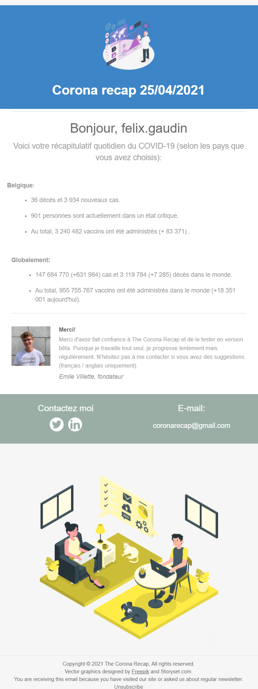

# The Coronavirus Recap
 A Coronavirus Tracker using Worldometer's and the John Hopkins University's API
## Features
[X] Personalized emails sent daily to the users (automatic running of the script TBI)
[X] HTML emails
[X] OAUTH2 authentification with the official Google GMAIL API
[X] Up to date data sourced from official government sites logged in a standardized format
[X] Cases, deaths, vaccines, tests, all you can wish for !
[X] backlogging of yesterday's missed information
[X] Simple to use and setup

## Installation
Contact @Emilevillette for instructions, standardized info will be released further along the road.

##Example mail
